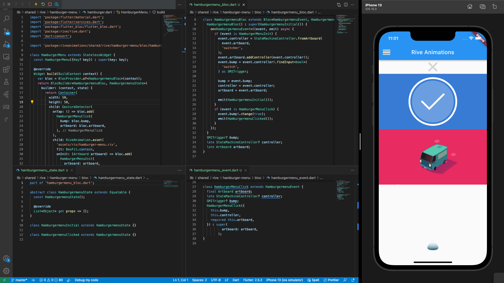

# Rive Animations on Flutter

Algumas animações a serem utilizadas como pre-set de futuros projetos

## Exemplo de Widget

```

class HamburgerMenu extends StatelessWidget {
  const HamburgerMenu({Key? key}) : super(key: key);

  @override
  Widget build(BuildContext context) {
    var bloc = BlocProvider.of<HamburgermenuBloc>(context);
    return BlocBuilder<HamburgermenuBloc, HamburgermenuState>(
      builder: (context, state) {
        return Container(
          width: 50,
          height: 50,
          child: GestureDetector(
            onTap: () => bloc.add(
              HamburgerMenuClick(
                bump: bloc.bump,
                artboard: bloc.artboard,
              ),
            ),
            child: RiveAnimation.asset(
              'assets/riv/hamburger-menu.riv',
              fit: BoxFit.contain,
              onInit: (Artboard artboard) => bloc.add(
                HamburgerMenuInit(
                  artboard: artboard,
                ),
              ),
            ),
          ),
        );
      },
    );
  }
}

```

## Interface BLoC

```

class HamburgermenuBloc extends Bloc<HamburgermenuEvent, HamburgermenuState> {
  HamburgermenuBloc() : super(HamburgermenuInitial()) {
    on<HamburgermenuEvent>((event, emit) async {
      if (event is HamburgerMenuInit) {
        event.controller = StateMachineController.fromArtboard(
          event.artboard,
          'switcher',
        );
        event.artboard.addController(event.controller!);
        event.bump = event.controller!.findInput<bool>(
          'switch',
        ) as SMITrigger;

        bump = event.bump;
        controller = event.controller;
        artboard = event.artboard;

        emit(HamburgermenuInitial());
      }
      if (event is HamburgerMenuClick) {
        event.bump!.change(true);
        emit(HamburgermenuClicked());
      }
    });
  }
  SMITrigger? bump;
  late StateMachineController? controller;
  late Artboard artboard;
}

```


